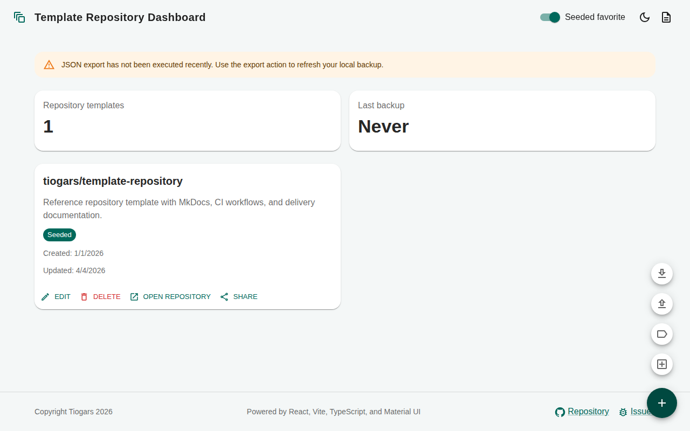

# template-repository


A GitHub repository template that ships a React webapp, a MkDocs documentation
site, and a set of GitHub Actions workflows for CI, CD, and documentation
generation.

## Description

**template-repository** is a full-stack boilerplate that lets you bootstrap new
projects with a ready-made React dashboard, a structured MkDocs documentation
site, and automated GitHub Actions pipelines. The included webapp is a
responsive browser-based dashboard for managing favourite GitHub repository
templates. All data is persisted locally in IndexedDB — no backend or account
is required.

## Screenshot



## Features

- 📋 **Repository template management** — add, edit, and delete favourite GitHub
  template repositories, each with a name, URL, description, owner, and tags.
- 🏷️ **Tag management** — create and delete colour-coded tags to categorise
  templates.
- 📊 **KPI dashboard** — at-a-glance counters for total templates and last
  backup date, with a warning when the backup is stale.
- 🔍 **Tag filtering** — filter the dashboard by one or more tags with
  single-click chip controls.
- 📤 **JSON export** — download the full dataset (templates, tags, preferences)
  as a JSON backup file.
- 📥 **JSON import** — restore data from a backup file using either a *merge*
  (additive) or *replace* (overwrite) strategy.
- 🌙 **Light / dark theme** — toggle between light and dark mode; preference
  is persisted across sessions.
- 📱 **Responsive design** — adapts to mobile, tablet, and desktop viewports
  using Material UI breakpoints.
- 🔗 **Share action** — copy a template URL to the clipboard or open the
  native share sheet on supported devices.

## Getting Started

### Requirements

- [Node.js](https://nodejs.org/) 24 or later
- [pnpm](https://pnpm.io/) 10 or later

### Installation

```bash
# Clone the repository
git clone https://github.com/tiogars/template-repository.git
cd template-repository

# Install dependencies
pnpm install
```

### Start the development server

```bash
pnpm dev
# Open http://localhost:5173
```

## Available Scripts

| Script | Description |
| ------ | ----------- |
| `pnpm dev` | Start the Vite development server at `http://localhost:5173`. |
| `pnpm build` | Bundle the webapp for production into `dist/`. |
| `pnpm preview` | Serve the production build locally for verification. |
| `pnpm test` | Run the Vitest test suite once. |
| `pnpm test:watch` | Run tests in watch mode. |
| `pnpm typecheck` | Run TypeScript type checking without emitting files. |
| `pnpm storybook` | Start the Storybook component explorer at `http://localhost:6006`. |
| `pnpm build-storybook` | Build the Storybook static site into `storybook-static/`. |

## Usage Guide

1. **Browse templates** — the dashboard loads with a seeded list of starter
   templates. Each card shows the name, description, GitHub link, dates, and
   tags.
2. **Add a template** — open the floating action button (**+**) in the
   bottom-right corner and click **Add repository template**. Fill in the form
   and confirm.
3. **Filter by tag** — click one or more tag chips below the KPI cards to
   restrict the visible templates.
4. **Manage tags** — open the FAB menu and click **Manage tags** to create or
   delete colour-coded tags.
5. **Export data** — open the FAB menu and click **Export JSON** to download a
   backup file. The **Last backup** KPI updates automatically.
6. **Import data** — open the FAB menu and click **Import JSON**, select a
   previously exported file, and choose *Merge* (additive) or *Replace*
   (overwrite all current data).
7. **Toggle theme** — click the sun / moon icon in the header to switch between
   light and dark mode.

## Project Structure

```text
template-repository/
├── assets/                         # Static project assets (favicon, screenshots)
├── docs/                           # MkDocs documentation source files
│   ├── 0-overview/                 # Project overview and README guide
│   ├── 1-specification/            # Functional and technical specification
│   ├── 2-delivery/                 # Implementation plan and milestones
│   ├── 3-review/                   # Implementation status and open points
│   └── 4-user-manual/              # End-user documentation
├── src/
│   ├── app/                        # Application shell, theme, and providers
│   │   ├── App.tsx
│   │   ├── layout/                 # AppShell layout component
│   │   ├── providers/              # React context providers (theme, etc.)
│   │   └── theme/                  # MUI theme factory
│   ├── assets/                     # Bundled assets (default seed data)
│   ├── components/                 # Reusable UI components
│   │   ├── FloatingActions/        # Speed-dial FAB menu
│   │   ├── Footer/                 # App footer
│   │   ├── Header/                 # App header with theme toggle
│   │   ├── KpiCard/                # KPI summary cards
│   │   ├── RepositoryTemplateCard/ # Template list card
│   │   ├── RepositoryTemplateDialog/ # Add / edit template form dialog
│   │   └── TagDialog/              # Tag management dialog
│   ├── features/                   # Feature-level entry points
│   │   ├── backup/
│   │   ├── dashboard/
│   │   ├── preferences/
│   │   ├── repository-templates/
│   │   └── tags/
│   ├── models/
│   │   └── AppData/                # Domain model, services, and repository
│   │       ├── controllers/        # useDashboardController hook
│   │       ├── repositories/       # IndexedDB repository implementation
│   │       ├── services/           # Application service and business logic
│   │       └── types/              # TypeScript domain types
│   ├── stories/                    # Storybook global styles
│   └── tests/                      # Test setup
├── .github/                        # GitHub Actions CI/CD workflows
├── docker-compose.yml              # Docker Compose for local docs build
├── mkdocs.yml                      # MkDocs configuration
├── vite.config.ts                  # Vite build configuration
└── package.json
```

## Design Highlights

The application uses a pastel-toned [Material UI](https://mui.com/material-ui/)
theme with distinct light and dark variants.

### Light mode

| Role | Colour | Usage |
| ---- | ------ | ----- |
| Primary | `#4db6ac` (Teal 300) | Buttons, active states, links |
| Secondary | `#ffb74d` (Orange 300) | Accent elements, secondary actions |
| Background | `#f4f7f7` | Page background |
| Paper | `#ffffff` | Cards, dialogs, panels |

### Dark mode

| Role | Colour | Usage |
| ---- | ------ | ----- |
| Primary | `#80cbc4` (Teal 200) | Buttons, active states, links |
| Secondary | `#ffcc80` (Orange 200) | Accent elements, secondary actions |
| Background | `#0f1720` | Page background |
| Paper | `#17212b` | Cards, dialogs, panels |

- **Pastel palette** — reduces visual contrast fatigue while remaining clearly
  distinguishable.
- **Global border radius** of `16 px` gives all components a consistent,
  friendly rounded appearance.
- **Responsive layout** — fluid grid adapts from single-column mobile to
  multi-column desktop using MUI breakpoints.

## Technology Stack

| Technology | Version | Purpose |
| ---------- | ------- | ------- |
| [](https://react.dev/) | 18 | UI framework |
| [](https://www.typescriptlang.org/) | 5 | Static typing |
| [](https://vite.dev/) | 6 | Build tool and dev server |
| [](https://mui.com/material-ui/) | 7 | Component library and theming |
| [](https://react-hook-form.com/) | 7 | Form state management |
| [](https://github.com/jakearchibald/idb) | 8 | IndexedDB promise wrapper |
| [](https://vitest.dev/) | 3 | Unit testing framework |
| [](https://storybook.js.org/) | 8 | Component explorer |
| [](https://pnpm.io/) | 10 | Package manager |
| [](https://squidfunk.github.io/mkdocs-material/) | – | Documentation site |

## Storage Architecture

All application data is stored exclusively in the browser using
**IndexedDB** — no server, database, or network connection is required
for data persistence.

```text
IndexedDB database: "template-repository-webapp"
└── Object store: "app-state"
    └── Key: "dataset"
        └── Value: AppDataSet (single JSON blob)
```

The `AppDataSet` blob contains all four domain entities serialised together:

```text
AppDataSet
├── templates[]       — repository template records
├── tags[]            — tag colour records
├── backupMetadata    — last export timestamp
└── userPreferences   — theme mode and seeded-favourite flag
```

On first load, a default seed dataset is written to IndexedDB automatically
(only when no existing data is found). On every subsequent load the persisted
blob is read and hydrated into the React state tree via
`useDashboardController`.

## Data Format for Backup

Exported files follow the `AppDataSet` JSON schema. Below is an annotated
example of the full backup format:

```json
{
  "templates": [
    {
      "id": "seed-tiogars-template-repository",
      "name": "tiogars/template-repository",
      "url": "https://github.com/tiogars/template-repository",
      "description": "Template with MkDocs, CI workflows, and delivery docs.",
      "templateName": "template-repository",
      "templateOwner": "tiogars",
      "createdAt": "2026-01-01T00:00:00.000Z",
      "updatedAt": "2026-04-04T00:00:00.000Z",
      "tagIds": ["tag-id-1"],
      "isSeeded": true,
      "isVisible": true
    }
  ],
  "tags": [
    {
      "id": "tag-id-1",
      "label": "documentation",
      "color": "#00695c"
    }
  ],
  "backupMetadata": {
    "lastExportAt": "2026-04-05T14:00:00.000Z"
  },
  "userPreferences": {
    "themeMode": "light",
    "showSeededFavorite": true
  }
}
```

### Field reference

**`templates[]`**

| Field | Type | Description |
| ----- | ---- | ----------- |
| `id` | `string` | Unique identifier (UUID or seed key). |
| `name` | `string` | Display name (`owner/repo` format recommended). |
| `url` | `string` | Full GitHub repository URL. |
| `description` | `string` | Short description of the template. |
| `templateName` | `string` | Repository name portion of the GitHub URL. |
| `templateOwner` | `string` | Owner (user or organisation) of the repository. |
| `createdAt` | `string` | ISO 8601 creation timestamp. |
| `updatedAt` | `string` | ISO 8601 last-update timestamp. |
| `tagIds` | `string[]` | Array of tag `id` values assigned to this template. |
| `isSeeded` | `boolean` | `true` for entries provided by the default seed. |
| `isVisible` | `boolean` | `true` when the template is shown on the dashboard. |

**`tags[]`**

| Field | Type | Description |
| ----- | ---- | ----------- |
| `id` | `string` | Unique identifier. |
| `label` | `string` | Human-readable tag name. |
| `color` | `string` | CSS hex colour string (e.g. `"#00695c"`). |

**`backupMetadata`**

| Field | Type | Description |
| ----- | ---- | ----------- |
| `lastExportAt` | `string \| null` | ISO 8601 timestamp of the last JSON export, or `null` if no export has been performed. |

**`userPreferences`**

| Field | Type | Description |
| ----- | ---- | ----------- |
| `themeMode` | `"light" \| "dark"` | Active colour scheme. |
| `showSeededFavorite` | `boolean` | Whether seeded templates are shown on the dashboard. |

## Documentation

The project documentation is built with [MkDocs Material](https://squidfunk.github.io/mkdocs-material/).
The source files live in the `docs/` directory and the configuration is in
`mkdocs.yml`.

## License

See [LICENSE](LICENSE).
