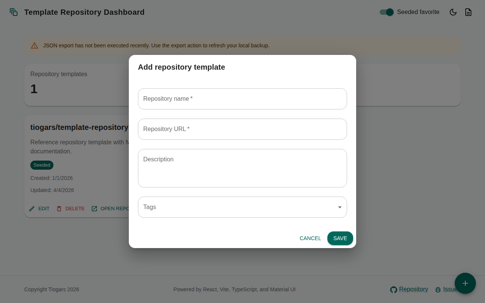
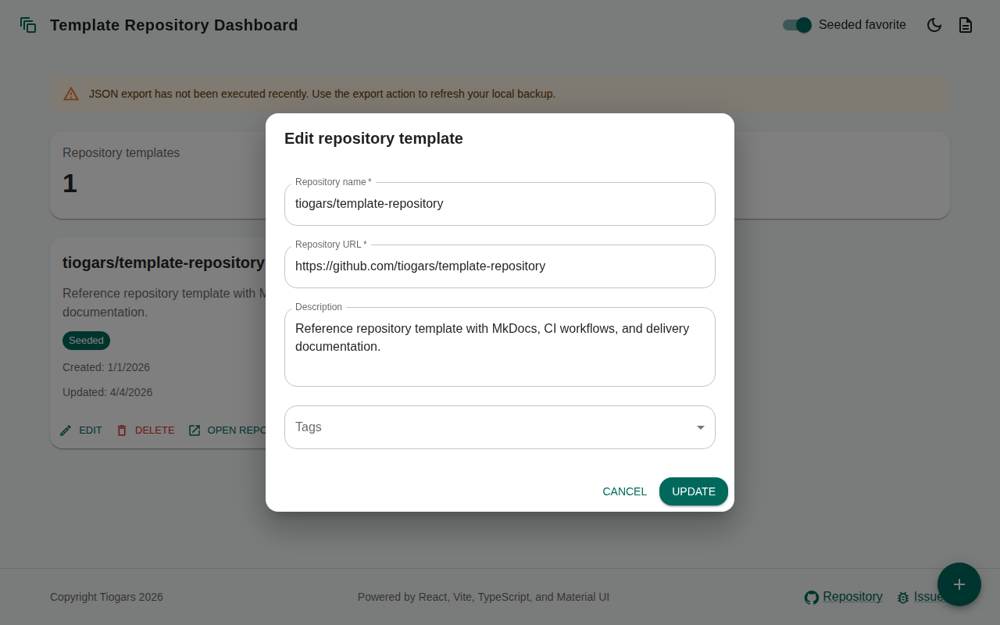

# 1.1.1.1 Repository Template Management

- The application must let the user create, edit, and delete favorite
  GitHub repository templates from a modal dialog containing a form.
- The form must support at least the following fields:
    - repository name
    - repository URL
    - description
    - creation date
    - last update date
    - tags
    - pinned as default favorite flag
- A default JSON seed must be bundled with the application and must
  contain the repository `tiogars/template-repository`.
- The seeded repository must be proposed as a favorite on first launch.
- The header must expose a toggle that lets the user show or hide the
  seeded favorite repository from the dashboard without deleting it.

## Add repository template

## Edit repository template

