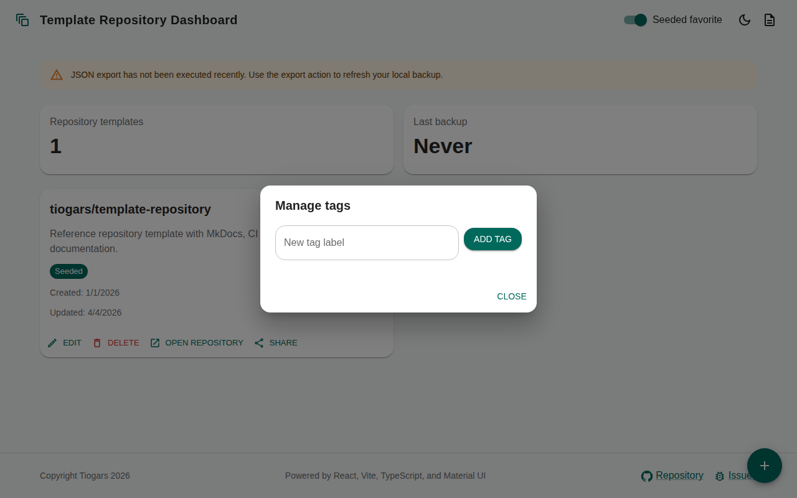

# 1.1.1.2 Tag Management

- The application must let the user create, rename, and delete tags.
- A repository template can be associated with zero, one, or many tags.
- Tags must be usable to categorize and visually identify repository templates.
- Tag selection must be integrated into the repository template form.

## Manage tags

