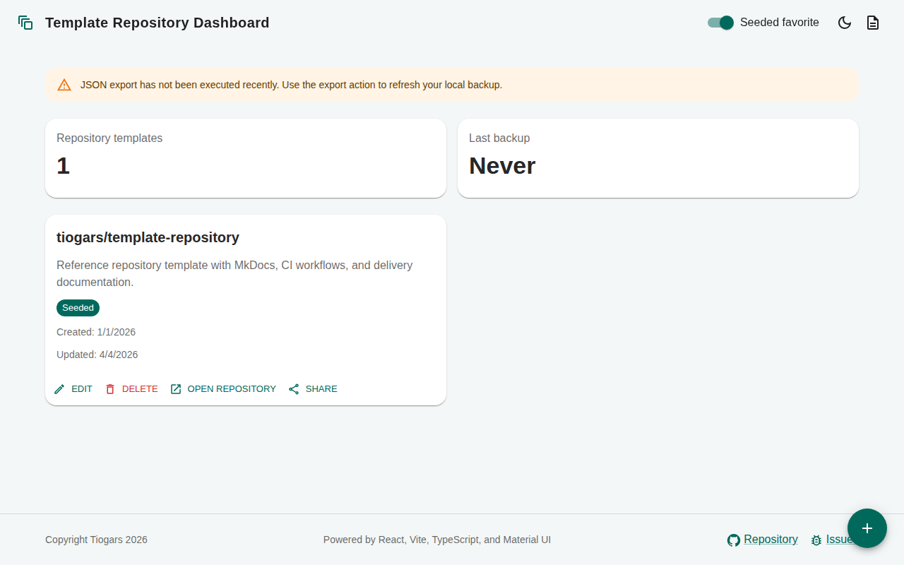

# 1.1.1.3 Dashboard

- Repository templates must be displayed in a dashboard composed of cards.
- Each card must display:
    - the template repository name
    - a description
    - a link to open the GitHub repository
    - the creation date
    - the last update date
    - a share action
- The dashboard must provide a KPI showing the total number of
  repository templates currently displayed.
- The dashboard must provide a KPI showing the date and time of the
  last successful JSON backup export.
- The dashboard should support empty-state messaging when no
  repository template is available.

## Dashboard overview

