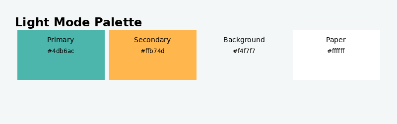
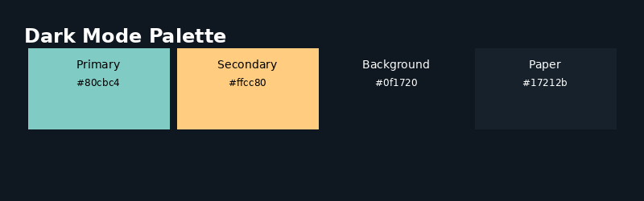

# 1.1.3.1 Theme Palette

The application uses a pastel-toned MUI theme with distinct light and dark
variants. The palette is defined in
`src/app/theme/createAppTheme.ts` and applied globally via the MUI
`ThemeProvider`.

## Light Mode

The light mode palette uses soft, pastel tones to provide a pleasant and
accessible interface without visual fatigue.

| Role | Hex | Usage |
|------|-----|-------|
| Primary | `#4db6ac` | Buttons, active states, links |
| Secondary | `#ffb74d` | Accent elements, secondary actions |
| Background default | `#f4f7f7` | Page background |
| Background paper | `#ffffff` | Cards, dialogs, panels |

## Dark Mode

The dark mode palette uses muted, pastel tones on a deep navy background for
comfortable low-light usage.

| Role | Hex | Usage |
|------|-----|-------|
| Primary | `#80cbc4` | Buttons, active states, links |
| Secondary | `#ffcc80` | Accent elements, secondary actions |
| Background default | `#0f1720` | Page background |
| Background paper | `#17212b` | Cards, dialogs, panels |

## Design Rationale

- **Pastel primary colours** (Teal 300 in light, Teal 200 in dark) reduce
  visual contrast fatigue compared to deeply saturated shades while remaining
  clearly distinguishable.
- **Pastel secondary colours** (Orange 300 in light, Orange 200 in dark)
  complement the teal primary and guide user attention to secondary actions.
- **Background neutrality** — the light background (`#f4f7f7`) has a faint
  cool tint that harmonises with teal; the dark background (`#0f1720`) uses a
  deep navy rather than pure black to reduce eye strain.
- **Global border radius** of `16 px` gives all components a consistent,
  friendly rounded appearance.
- MUI automatically derives `contrastText` from each `main` colour to ensure
  legible text on all coloured surfaces.
